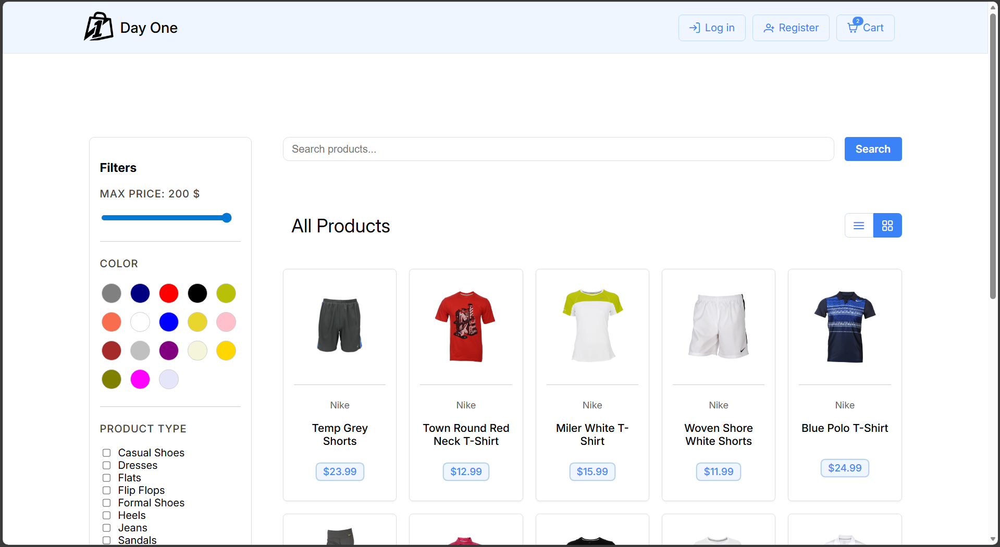
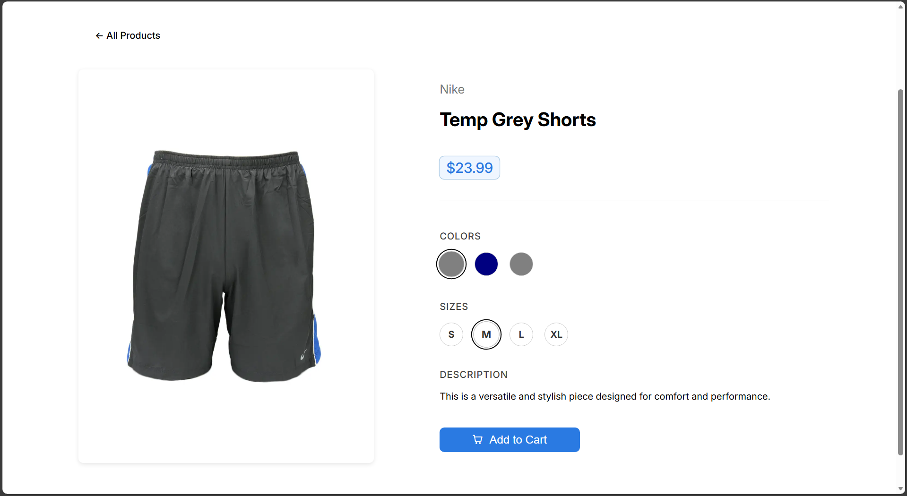
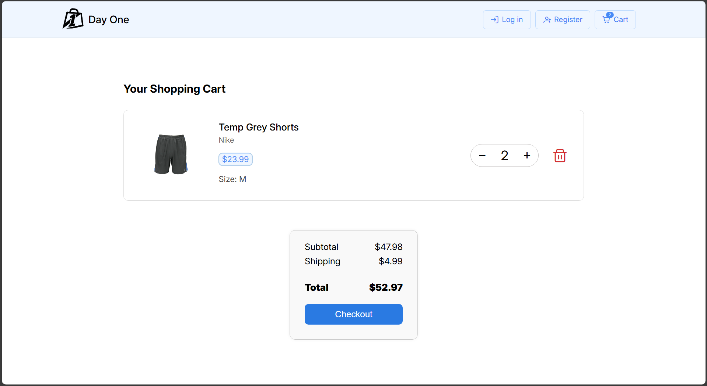
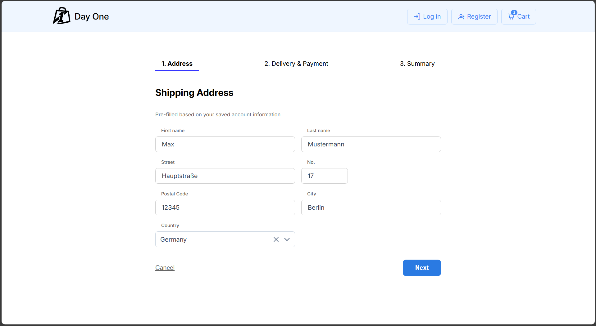
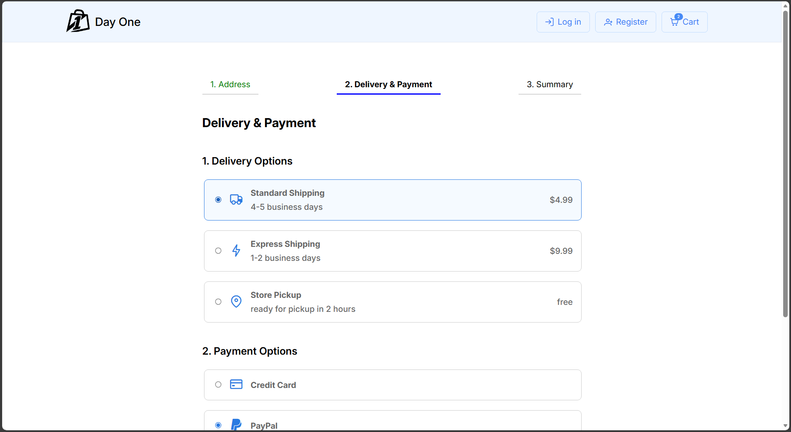
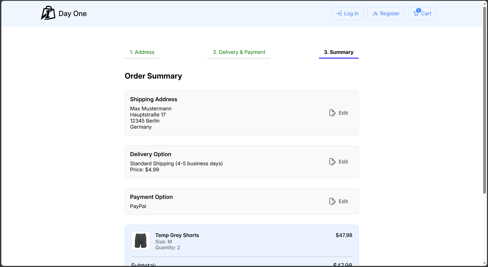
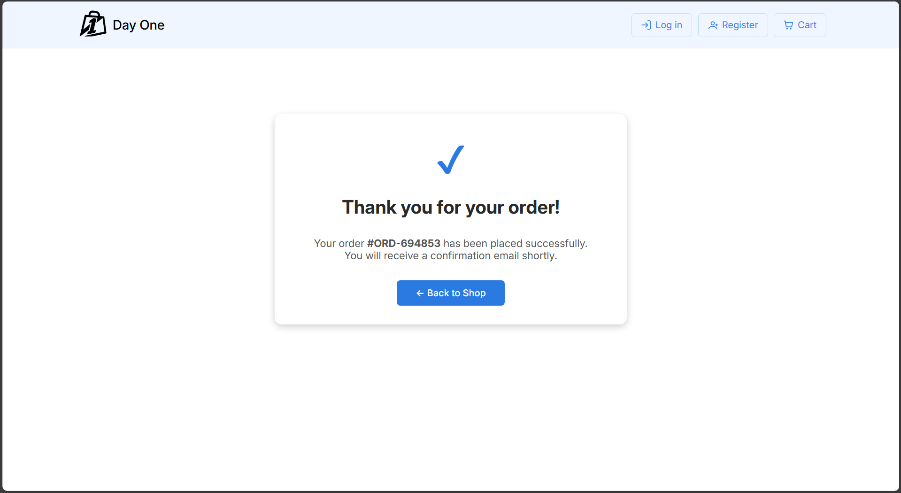

# University Team-Project: Online Shop UI

This project was developed as part of the *Interactive Systems* course at the University of Konstanz in a team of three students. The goal was to design and implement a **User Interface** for an **Online Shop** (frontend-only), based on **UI design patterns** taught in the course. The focus is on usability and a smooth shopping experience from browsing to checkout. Responsiveness was implemented for the parts specified in the course.


---

## Demo-Video of Online Shop UI

You can watch the online shop UI demo on YouTube: click [here](https://youtu.be/vHRzpdn4EuU)


## Screenshots of Online Shop UI

<p align="center">
  
  
</p>

<p align="center">
  
  
</p>

<p align="center">
  
  
</p>

<p align="center">
  
  
</p>


---

## Table of Contents

This README provides the key features of the project, describes the technologies used, lists the requirements needed to run the website, explains how to set up and start it locally. It also includes a summary of my individual contributions.

1. [Key features](#key-features)  
2. [Tech stack](#tech-stack)  
3. [Requirements to run the website](#requirements-to-run-the-website)  
4. [How to run the website](#how-to-run-the-website)
5. [My contributions](#my-contributions)


---

## Key features

**1) Login & registration**
- Login and registration pages with structured forms, validation, and clear error messages (UI-only)

**2) Product browsing**
- Products overview with **list and grid view**
- Products shown with image, name, brand and price
- Dynamic loading ("load more") with a loading indicator

**3) Search & filter**
- Search by product name 
- Filter sidebar with price, color, product type and brand
- Active filter indicators (chips) with remove option and "clear all"

**4) Product details**
- Product details page with image, name, brand, price and description
- Color and size selection (Color selection updates the displayed product image)
- Add-to-cart with selection checks and clear user feedback

**5) Shopping cart**
- Cart page with quantity control, remove button, live total price calculation (incl. shipping fee)
- Cart is saved across page reloads 
- Cart badge in the header showing the current cart count

**6) Checkout**
- Multi-step checkout wizard: **Address -> Delivery & Payment -> Summary**
- **Address** step: structured forms, validation, and clear error messages, using a pre-filled (editable) address
- **Delivery & Payment** step: choose one shipping option and one payment option
- **Summary** step: review all details (edit previous steps), prices (subtotal, shipping cost, total), and confirm purchase (clears cart)
- Success page after completing checkout (confirmation and button back to the product list)


Responsiveness was implemented for the parts specified in the course: **header**, **login**, **registration**, **products overview** (list/grid), **search/filter**, and the **checkout process** (wizard and success page)


---

## Tech stack

**Language**
- **TypeScript**

**Frontend**
- **Angular** (main frontend framework)
- **PrimeNG** (UI components)


---

## My contributions

### Header 
- Implemented the header navigation (shop logo/name and buttons for login, registration, and cart)

### Login & registration 
- Implemented the complete login and registration pages
- Added a structured form layout with validation and clear error messages / user feedback

### Product overview
- Implemented the grid view for the products overview, including the product cards (image, name, brand, price)
- Implemented "load on scroll" with loading indicator

### Shopping cart 
- Implemented the complete shopping cart page (quantity control, remove, total price)
- Ensured the cart is saved across page reloads 

### Checkout
- Implemented the complete checkout wizard, including step logic, validation, and step navigation
- **Address:** pre-filled, editable address form with clear error messages
- **Delivery & Payment:** selectable shipping and payment options
- **Summary:** edit-back options, price overview (subtotal, shipping cost, total), and order confirmation (clears cart)
- Implemented the success page after completing checkout

### Responsive design
- Made the header responsive
- Made login & registration responsive
- Made the complete checkout process responsive (wizard and success page)


---

## Requirements to run the website

To run the website locally you need to install the following tool:

- **Node.js** ([Download](https://nodejs.org/en/download))<br>
  Includes **npm** (Node package manager)

All project dependencies (TypeScript, Angular, PrimeNG) are installed via `npm install`.


---

## How to run the website

### 1) Clone the repository

### 2) Stay in the `online-shop/` directory of the project.

### 3) Install dependencies

```bash
npm install
```

### 4) Start the website (local)

```bash
npm start
```

### 5) Open the website

- Open `http://localhost:4200` in your browser. 

### 6) How to stop the website

- Press `Ctrl + C` 
